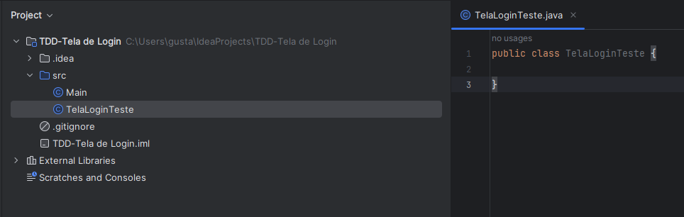
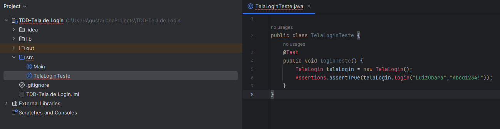
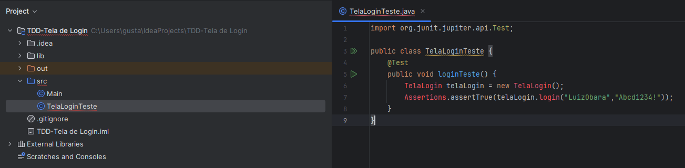
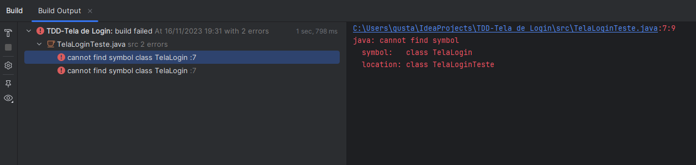
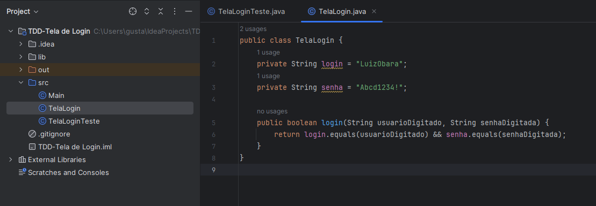
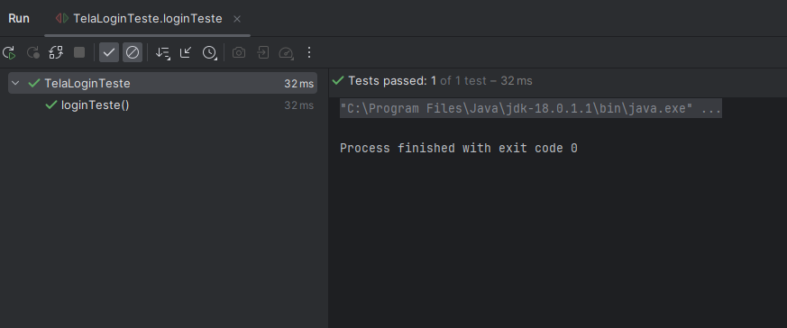
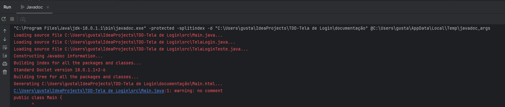
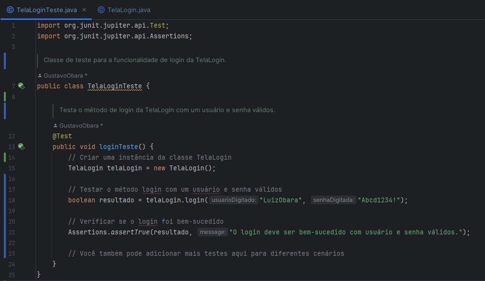
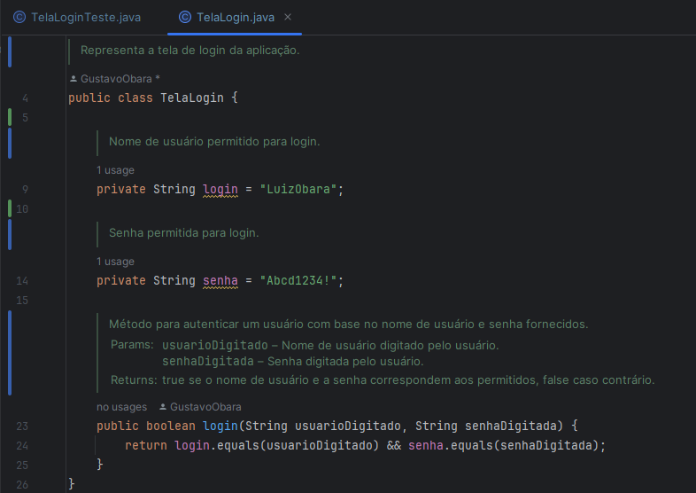

# TDD Tela de Login
Avaliação Final de Qualidade e Testes de Software

NESTA ATIVIDADE CRIAREMOS UM PROJETO JAVA PARA AUTENTICAÇÃO DE USUÁRIO E SENHA;
UTILIZAREMOS O PROCESSO DE TDD;

### DEVEMOS SEGUIR OS CINCO PASSOS:

<ul>
    <li>Passo 1: Escrever o teste unitário (JUnit) para a tela de login;</li>
    <li>Passo 2: Execute o teste unitário;</li>
    <li>Passo 3: Implementar a classe LoginScreen;</li>
    <li>Passo 4: Execute o teste unitário novamente;</li>
    <li>Passo 5: Documentação, exportar o JAVADOC;</li>
</ul>

## Passo inicial - Criação do projeto

## Passo 1 - Escrever o teste unitário (JUnit) para a tela de login

## Passo 1.1 - Adicionar o JUnit no projeto

## Passo 2 - Execute o teste unitário

## Passo 3 - Implementar a classe LoginScreen

## Passo 4 - Execute o teste unitário novamente

## Passo 5 - exportar o JAVADOC
Foi gerado na pasta [`documentação/`](documentação/)

## Passo 5 - Documentação do código
### TelaLoginTeste.java

### TelaLogin.java

# Última atualização - 16/11/2023
